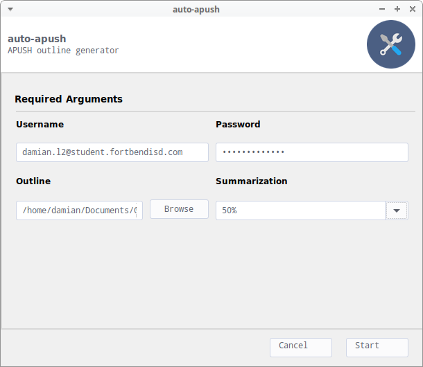
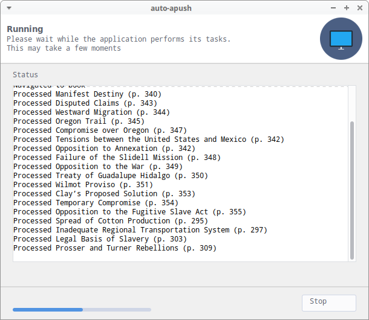
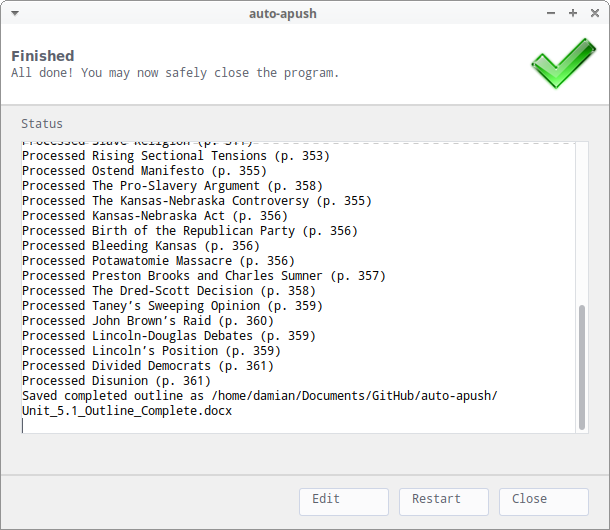

# auto-apush
APUSH outline generator

## Installation
Install the necessary dependencies with pip
```
pip install -r requirements.txt
```

## Screenshots
Config Screen  |  In Progress  |  Outline Complete
:-------------:|:-------------:|:------------------:
 |  | 
